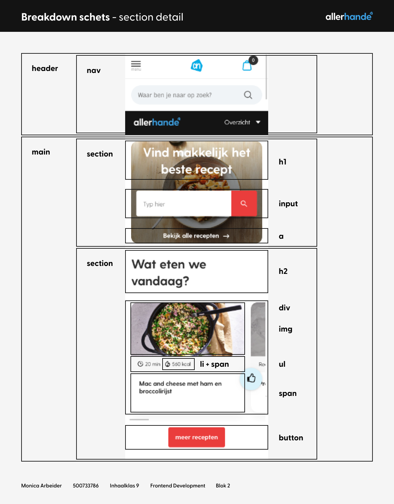
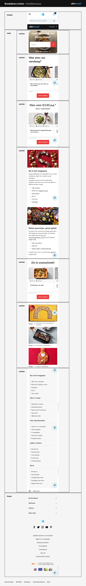
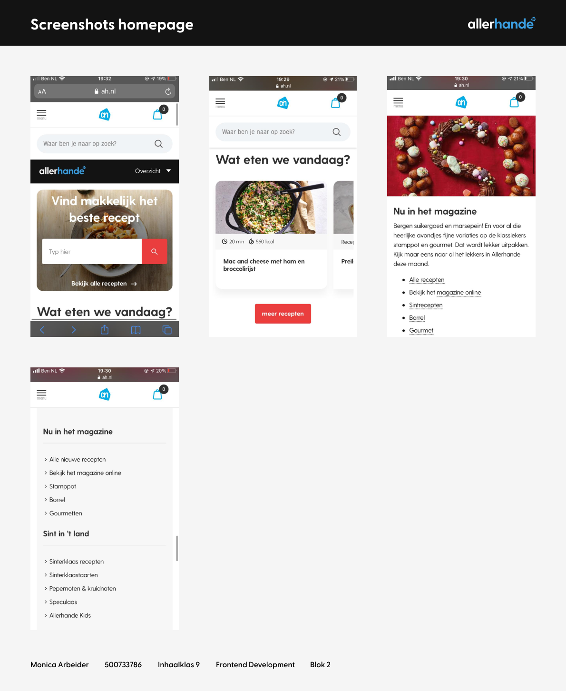
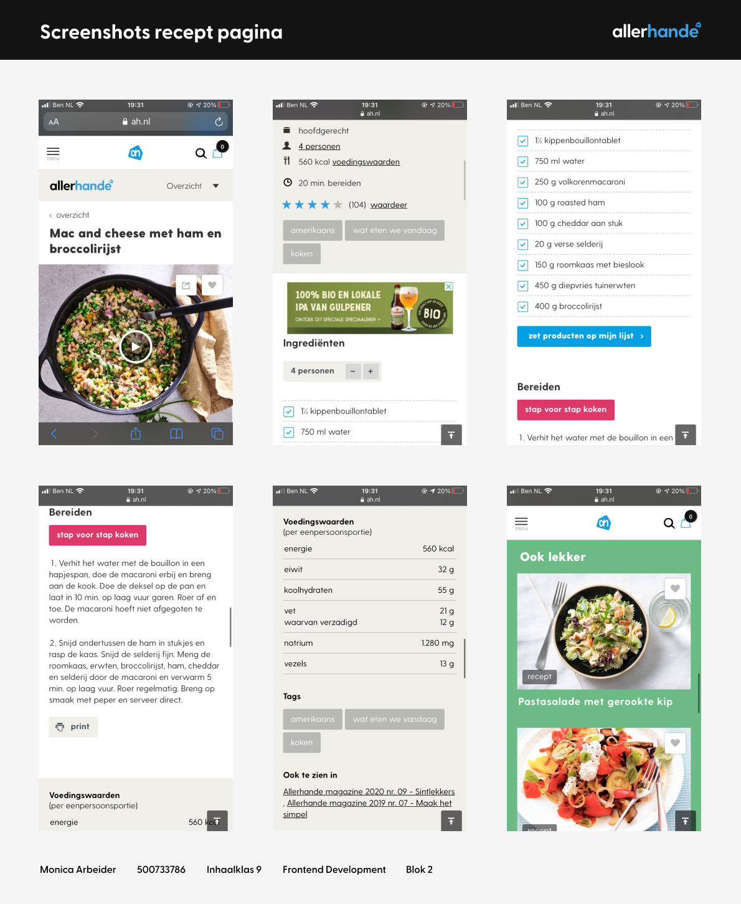

# Procesverslag
**Student:** Monica Arbeider

**Studentnummer:** 500733786

**Klas:** KlasInh09

**Markdown Cheat Sheet:** [Hulp bij het schrijven van Markdown](https://github.com/adam-p/markdown-here/wiki/Markdown-Cheatsheet)

## Bronnenlijst
1. -bron 1-
2. -bron 2-
3. -...-

## Eindgesprek (week 7/8)

-dit ging goed & dit was lastig-

**Screenshot(s):**

-screenshot(s) van je eindresultaat-

## Voortgang 3 (week 6)

-same as voortgang 1-

## Voortgang 2 (week 5)

-same as voortgang 1-

## Voortgang 1 (week 3)

### Stand van zaken

-dit ging goed & dit was lastig-

**Screenshot(s):**

-screenshot(s) van hoe ver je bent met korte uitleg-

### Agenda voor meeting

-samen met je groepje opstellen-

| student 1      | student 2          | student 3    | student 4        |
| ---            | ---                | ---          | ---              |
| dit bespreken  | en dit             | en ik dit    | en dan ik dat    |
| an dat ook nog | dit als er tijd is | nog een punt | dit wil ik zeker |
| ...            | ...                | ...          | ...              |

### Verslag van meeting

-na afloop snel uitkomsten vastleggen-

## Breakdownschets (week 1)

**Breakdownschets:** Allerhande homepage hoofdstructuur + section details

## Intake (week 1)

**Je startniveau:** Rode pieste

**Je focus:** Responsive

**Je opdracht:** [AH Allerhande](https://www.ah.nl/allerhande)

**Screenshots eerste pagina:** Allerhande homepage

**Screenshots tweede pagina:** Allerhande recept

